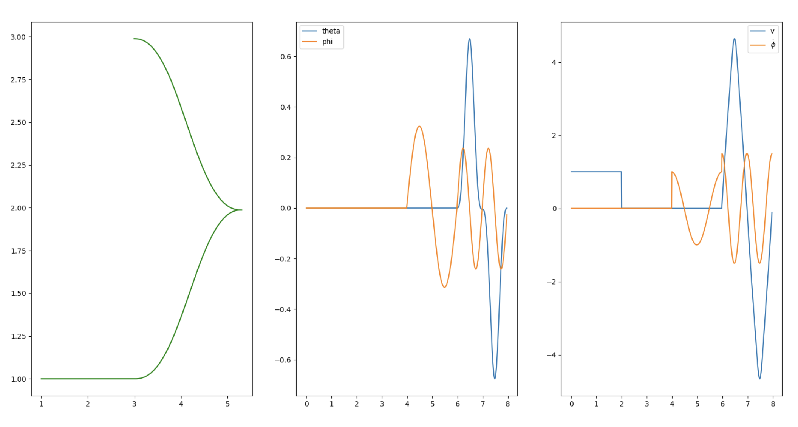
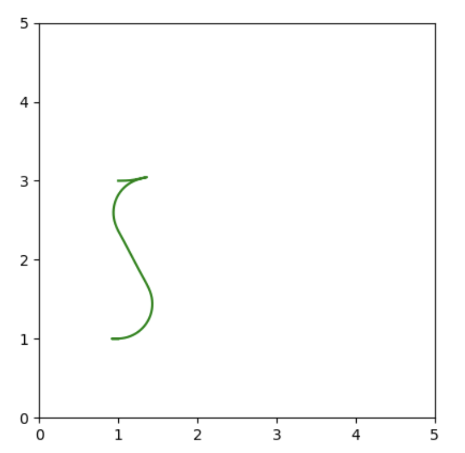
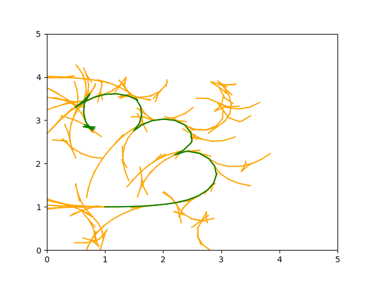

### Path Planning to Parallel Park!

This code implements three different path planners to parallel park a bicycle-model based car!

- Sinusoids: Based on [this](https://ieeexplore.ieee.org/stamp/stamp.jsp?tp=&arnumber=277235) paper written by my robotics professor (Shankar Sastry)!
- Optimization: Implemented using the FATROP solver in CasADi, with a banded structure for fast solve times. Based on the bicycle model, structured to minimize solve times while respecting the vehicle constraints.
-RRT*: Standard random sampling-based algorithm for path planning, using motion primitives of vehicle movements based on the bicycle model. Able to plan around obstacles modeled as circles.

The optimization and RRT planners are both capable of handling obstacles modeled as circles! 

I attatched the paper I wrote for my robotics class [here](visuals/106B_Project_2__Planning_with_Sinusoids-1.pdf), along with some more results on plots!

### Optimization Parallel Park 

### RRT Parallel Park

### Sinusoid Parallel Park

